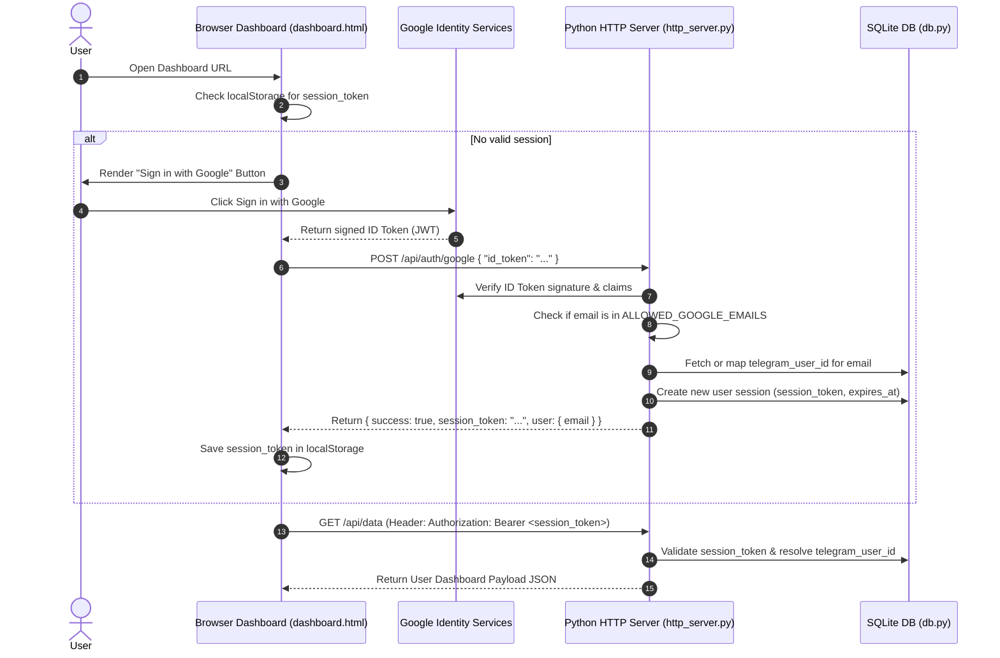

# Google SSO Authentication Design Specification

**Date:** 2026-07-29  
**Status:** Approved  
**Project:** `telegram-finance-bot`

---

## 1. Overview & Goal

The `telegram-finance-bot` web dashboard currently uses a single URL token parameter (`?token=<hex_string>`) generated per user to authenticate HTTP API requests (`/api/data`, `/api/update`, `/api/delete`, `/api/sync_recurring`).

This project replaces static token authentication with **Google Single Sign-On (SSO)** using Google Identity Services (GIS). Users accessing the web dashboard will authenticate via Google OAuth 2.0 / OpenID Connect (OIDC). The backend will cryptographically verify Google's signed ID Token, map the user's Google email address to their existing `telegram_user_id`, and establish a server-side session.

### Key Constraints & Requirements
- **Data Protection & Integrity:** All historical transaction records, debts, recurring items, and categories linked to `telegram_user_id` MUST remain 100% intact and unaffected.
- **Whitelist Enforcement:** Only Google emails listed in `ALLOWED_GOOGLE_EMAILS` (or mapped in the database) are allowed to sign in.
- **Backward Compatibility & Safety:** Existing Telegram Bot commands remain uninterrupted.
- **Zero Cost:** Uses free Google Identity Services / OpenID Connect ID Tokens.

---

## 2. Architecture & Authentication Flow



---

## 3. Detailed Component & Schema Changes

### 3.1 Database Schema (`db.py`)

#### `users` Table Migration
Add a `google_email` column to associate Google emails with Telegram users:
```sql
ALTER TABLE users ADD COLUMN google_email TEXT UNIQUE;
```

#### New `user_sessions` Table
Store server-side authenticated user sessions:
```sql
CREATE TABLE IF NOT EXISTS user_sessions (
    session_id TEXT PRIMARY KEY,
    telegram_user_id INTEGER NOT NULL,
    created_at TIMESTAMP DEFAULT CURRENT_TIMESTAMP,
    expires_at TIMESTAMP NOT NULL,
    FOREIGN KEY (telegram_user_id) REFERENCES users(telegram_user_id)
);
```

#### New/Updated Database Functions in `db.py`
1. `get_user_id_by_google_email(email: str) -> Optional[int]`
2. `link_google_email(telegram_user_id: int, email: str) -> bool`
3. `create_user_session(telegram_user_id: int, ttl_days: int = 7) -> str`
4. `get_user_id_by_session(session_token: str) -> Optional[int]`
5. `delete_user_session(session_token: str) -> bool`
6. `cleanup_expired_sessions() -> None`

---

### 3.2 Backend Server (`handlers/http_server.py`)

#### Environment Variables (`.env`)
- `GOOGLE_CLIENT_ID`: Google OAuth 2.0 Client ID.
- `ALLOWED_GOOGLE_EMAILS`: Comma-separated list of allowed Google email addresses (e.g. `owner@gmail.com`).

#### ID Token Verification Logic
The backend handler for `POST /api/auth/google` will:
1. Parse `id_token` from JSON request body.
2. Verify token signature against Google's public certificates (via `google-auth` Python library or Google's tokeninfo OIDC endpoint `https://oauth2.googleapis.com/tokeninfo?id_token=...`).
3. Assert that `aud` matches `GOOGLE_CLIENT_ID` and `email_verified` is `true`.
4. Check if token email is contained in `ALLOWED_GOOGLE_EMAILS`.
5. Map email to `telegram_user_id` (if only 1 user exists or email is linked, map to primary `telegram_user_id`).
6. Call `create_user_session(user_id)` and return JSON `{ "success": true, "session_token": token, "email": email }`.

#### API Endpoint Route Updates
Update `/api/data`, `/api/update`, `/api/delete`, `/api/sync_recurring` to extract the session token from:
- `Authorization: Bearer <session_token>` header, OR
- `session_token` parameter in query string / JSON body.

Validate `user_id = db.get_user_id_by_session(session_token)`. If invalid or expired, return `401 Unauthorized`.

#### Logout Endpoint
- `POST /api/auth/logout`: Calls `db.delete_user_session(session_token)` and returns `{ "success": true }`.

---

### 3.3 Frontend Dashboard (`dashboard/template.html` / `dashboard.html`)

#### UI Layout & Authentication State
- **Unauthenticated View:**
  - Full-screen modal overlay with dark glassmorphic card styling.
  - Title: "Finance Dashboard Access".
  - Google Sign-In button container `<div id="g_id_onload"></div>` initialized with `GOOGLE_CLIENT_ID`.
- **Authenticated View:**
  - Header displays logged-in Google email avatar/chip and a **"Sign Out"** button.
  - Sign Out button clears `localStorage.getItem("session_token")`, notifies backend `/api/auth/logout`, and reloads to the login prompt.

---

### 3.4 Telegram Bot Commands (`handlers/commands.py`)

- Update `/dashboard` command handler:
  - Responds with the web dashboard URL (e.g. `http://localhost:8080/dashboard`).
  - No longer appends sensitive secret tokens into the public URL.

---

## 4. Security & Safety Principles

1. **Strict Cryptographic Signature Verification:** Backend never trusts client-supplied email strings without verifying Google's cryptographic JWT signature.
2. **Whitelist Boundary:** Unwhitelisted Google accounts receive `403 Forbidden` response even if successfully authenticated by Google.
3. **Session Expiry:** Server-side session tokens expire after 7 days and can be manually invalidated via logout.
4. **Data Isolation:** All transaction reads and writes remain tied strictly to `telegram_user_id`.

---

## 5. Verification Plan

### Automated / Unit Tests
- Test database session creation, expiration, and invalidation in `test_pipeline.py`.
- Test email-to-user-id mapping functions.

### Manual Verification Steps
1. **Google Login:** Open dashboard in browser, sign in with allowed Google account $\rightarrow$ verify dashboard loads transaction data.
2. **Unauthorized Account:** Try signing in with an unwhitelisted Google email $\rightarrow$ verify access is denied with 403 error.
3. **Data Integrity:** Compare transactions displayed on the SSO dashboard against `/summary` in Telegram bot $\rightarrow$ verify exact match.
4. **Logout Flow:** Click "Sign Out" $\rightarrow$ verify session is destroyed and dashboard requires re-login.
