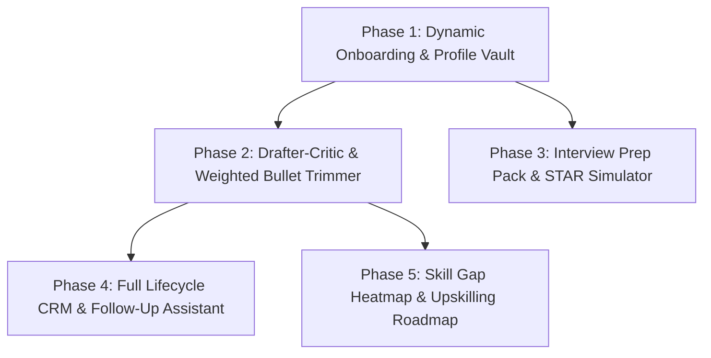

# 🗺️ CareerCraft Product Evolution Roadmap & TODOs

This roadmap tracks the planned transformation of **CareerCraft** into a comprehensive, autonomous, user-centric career engineering ecosystem.

---

## 🎯 High-Level Architecture Plan

---

## 📋 Phase-by-Phase TODO Checklist

### ✅ Completed Milestones
- [x] **Zero-Cost CDP Chrome Bridge**: Connects over WebSocket port 9222 for free local LLM operations.
- [x] **Master ATS Single-Column PDF Studio**: Playwright/Chromium instant sub-second compilation.
- [x] **3-Pillar Unified Scorecard**: GitHub, LinkedIn, and Master Resume auditing with actionable insights.
- [x] **Instant JD Link Fetcher & Auto-Parser**: Paste any job opening link (LinkedIn, Greenhouse, Lever, Ashby, Instahyre, Naukri) to auto-extract Title, Company, Location, and full JD.
- [x] **Refined Design System & Visual Polish**: Clean, accessible CSS design tokens with status indicators and responsive layout.

---

### 🚀 Phase 1: Dynamic User Onboarding & Multi-Profile Vault (Next Up)
- [ ] **3-Way Onboarding Importer (`/setup` pattern)**:
  - [ ] **Path A (File Drop)**: Upload PDF/DOCX Resume, LinkedIn PDF export, or credentials to auto-parse structure.
  - [ ] **Path B (Raw Paste)**: Text paste parser extracting work history, skills, and summary.
  - [ ] **Path C (AI Interview)**: 5-minute interactive onboarding chat in browser to build profile from scratch.
- [ ] **Multi-Profile & Target Persona Switcher**:
  - [ ] Support saving multiple profile tracks (e.g. *Senior Android Engineer* vs *Staff Mobile Architect* vs *Full-Stack Lead*).
  - [ ] Top navigation Profile Switcher dropdown with persistent SQLite storage.
- [ ] **Custom Target Job Preferences**:
  - [ ] Configure target CTC / salary range, notice period, location preferences (Remote/Hybrid/Cities), and company blacklist.

---

### ✍️ Phase 2: Drafter-Critic Tailoring & Relevance-Weighted Trimmer
- [ ] **2-Pass Drafter-Critic Agent Pipeline (`/apply` pattern)**:
  - [ ] **Drafter Pass**: Generates tailored resume bullets and cover letter aligned with target JD.
  - [ ] **Critic Pass**: Independent AI review auditing 5 dimensions (Hard skills, Impact metrics, Tone, ATS readability, and the Anti-Hallucination Honesty Rule).
- [ ] **Relevance-Weighted Bullet Trimmer**:
  - [ ] Score individual experience bullets by $\text{Relevance} + \text{Metrics Density} + \text{Uniqueness}$.
  - [ ] Intelligently drops low-relevance bullets first to strictly fit 1-page or 2-page print layout without bottom-cutting.

---

### 🎤 Phase 3: AI Interview Prep Pack & STAR Story Simulator
- [ ] **Stage-Specific Interview Pack Generator (`/interview` pattern)**:
  - [ ] Generate customized preparation packs for:
    - Initial Recruiter Screening
    - Technical Architecture & System Design
    - Coding & Problem Solving
    - Behavioral & Executive Leadership
- [ ] **STAR Accomplishment Matrix**:
  - [ ] Auto-map job description requirements to candidate's real STAR stories (Situation, Task, Action, Result).
- [ ] **Interactive Mock Interview Simulator**:
  - [ ] Browser-based voice/text simulation asking real company-specific questions with real-time feedback and bridge answers for skill gaps.

---

### 📊 Phase 4: Application Lifecycle CRM & Smart Outreach Copilot
- [ ] **Full Application Pipeline Kanban (`/outcome` pattern)**:
  - [ ] Stages: `Queued` ➔ `Applied` ➔ `Screening` ➔ `Tech Round` ➔ `Offer` / `Archived`.
- [ ] **10-Day Silence Follow-Up Copilot**:
  - [ ] Detect applications with no update for 10+ days and draft polite, contextual follow-up emails.
- [ ] **Post-Interview Thank-You Note Generator**:
  - [ ] 1-click generation citing specific technical topics discussed in previous rounds.
- [ ] **Recruiter Cold Outreach Assistant**:
  - [ ] Tailored LinkedIn InMail & cold email pitch generation targeting hiring managers and engineering leads.

---

### 📈 Phase 5: Skill Gap Heatmap & 30-Day Upskilling Roadmap
- [ ] **Cross-Job Aggregate Gap Analyzer (`/upskill` pattern)**:
  - [ ] Aggregates missing keywords across all queued, tailored, and target job postings.
- [ ] **Visual Skill Gap Heatmap**:
  - [ ] Interactive matrix visualizing high-frequency market demands vs candidate's current capabilities.
- [ ] **Personalized 30-Day Learning Roadmap**:
  - [ ] Generates curated study paths with direct documentation links, recommended open-source repos, and realistic time estimates.

---

## 📅 Immediate Next Steps for Tomorrow:
1. Review and refine the **Phase 1 Technical Specification** (`docs/superpowers/specs/phase-1-dynamic-onboarding.md`).
2. Implement the **3-Way Profile Importer** (PDF / Text / AI Chat) in `src/core/profile-importer.js`.
3. Add the **Profile Switcher UI** and multi-persona database schema in `src/db/database.js`.
